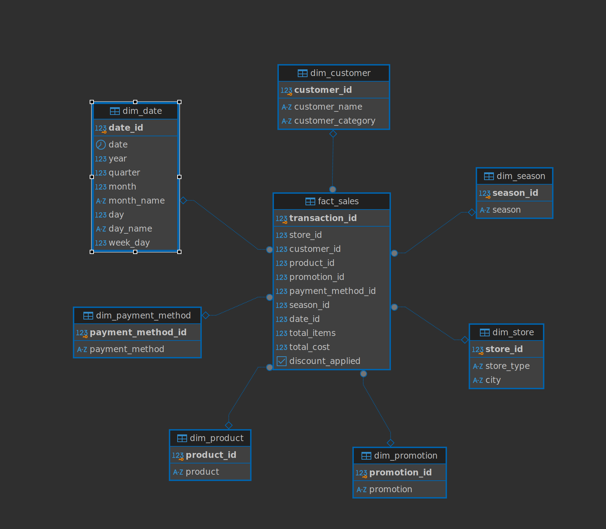
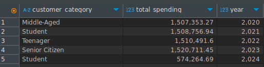
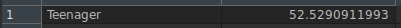
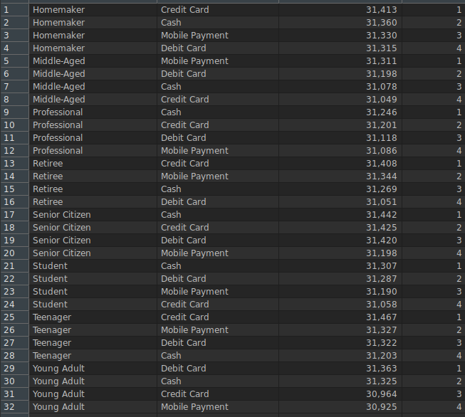
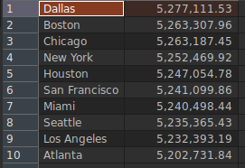
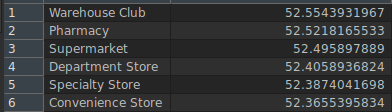

## Project Summary <br>
This project involves building a data warehouse using a star schema to centralize retail transaction data for future analysis. The dataset, initially stored in an S3 bucket, is processed through an ETL pipeline to extract, transform, and load the data into the data warehouse.

The data warehouse is implemented using the PostgreSQL database engine, ensuring scalability and efficient querying. Finally, potential business questions are formulated to demonstrate how the data warehouse can provide actionable insights.

<strong>Dataset</strong>: https://www.kaggle.com/datasets/prasad22/retail-transactions-dataset?resource=download

<strong>Technologies Used</strong>: Python | Pandas | Postgres | SQL | ETL <br>

<strong>Diagram</strong>:


### Some Business Questions Solved

<strong>Which category of clients generate the most revenue per year?</strong> <br>
<strong>SQL:</strong>
```
WITH ranks AS (
    SELECT  
        dc.customer_category, 
        dd.year,
        SUM(fs.total_cost) AS total_spending,
        RANK() OVER (
            PARTITION BY dd.year
            ORDER BY SUM(fs.total_cost) DESC
        ) AS rank
    FROM 
        fact_sales fs
    JOIN 
        dim_customer dc ON fs.customer_id = dc.customer_id
    JOIN 
        dim_date dd ON fs.date_id = dd.date_id
    GROUP BY 
        dc.customer_category,
        dd.year
    ORDER BY 
        dd.year
)
SELECT 
    customer_category, 
    total_spending, 
    year
FROM ranks
WHERE rank = 1
ORDER BY year;
```
<strong>RESULT:</strong> <br>

<br>
<br>
<br>

<strong>What category of customer spends the most on average in the last 5 years?</strong> <br/>
<strong>SQL:</strong> <br>
```
SELECT  
    dc.customer_category,  
    AVG(fs.total_cost) AS average_spending
FROM 
    fact_sales fs
JOIN 
    dim_customer dc ON fs.customer_id = dc.customer_id
GROUP BY 
    dc.customer_category
ORDER BY 
    average_spending DESC
LIMIT 1;
```
<strong>RESULT:</strong> <br>



<strong>What is the preference of payment methods by customer category?</strong><br>
<strong>SQL:</strong>
```
SELECT  
    dc.customer_category, 
    dpm.payment_method, 
    COUNT(fs.transaction_id) AS transaction_count,
    RANK() OVER (
        PARTITION BY dc.customer_category
        ORDER BY COUNT(dpm.payment_method) DESC
    ) AS rank
FROM 
    fact_sales fs
JOIN 
    dim_customer dc ON fs.customer_id = dc.customer_id
JOIN 
    dim_payment_method dpm ON fs.payment_method_id = dpm.payment_method_id
GROUP BY 
    dc.customer_category, 
    dpm.payment_method;
```

<strong>RESULT:</strong> <br>


<strong>Which cities generate the most income? </strong> <br>
<strong>SQL:</strong>
```
SELECT  
    ds.city,  
    SUM(fs.total_cost) AS total_sales
FROM 
    fact_sales fs
JOIN 
    dim_store ds ON fs.store_id = ds.store_id 
JOIN 
    dim_date dd ON fs.date_id = dd.date_id
GROUP BY 
    ds.city
ORDER BY 
    total_sales DESC;
```
<strong>RESULT:</strong> <br>
 <br>


<strong>What type of store has a higher average sales per transaction?</strong> <br>
<strong>SQL:</strong>
``` 
SELECT  
    ds.store_type,                
    AVG(fs.total_cost) AS avg_sales_per_transaction  
FROM 
    fact_sales fs
JOIN 
    dim_store ds ON fs.store_id = ds.store_id

GROUP BY 
    ds.store_type  
ORDER BY 
    avg_sales_per_transaction DESC; 
```

<strong>RESULT:</strong> <br>
